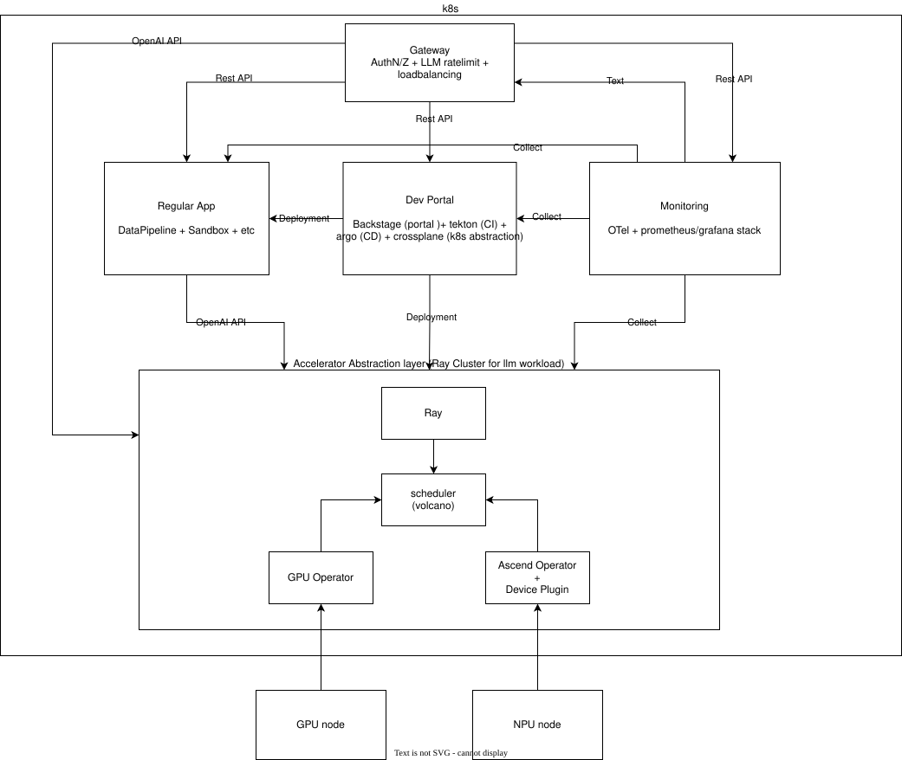

# Kubernetes Convenient Cluster

## Intro
This project aims to provides an full proof way to install k8s & necessary modules for user to utilizing their on-premise machines with accelerators.
The clusters let user deploy, servicing(w/ auth & rate limiting), & monitoring their llm apps/workloads. 

## Design

