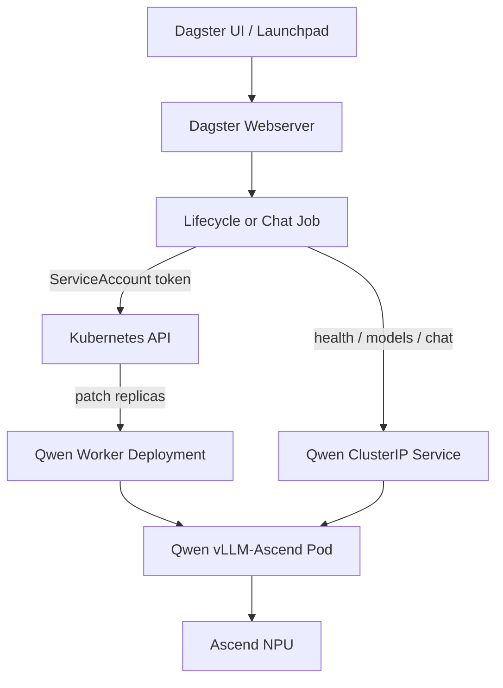

# Dagster Qwen Lifecycle 独立部署与迁移指南

## 1. 模块定位

`dagster-qwen-ops` 与 K12 Data Lake、MinerU、Cleaning/QA、Ray 和 MinIO 完全独立，只验证以下能力：

```text
Dagster Job
  -> Kubernetes Deployment replicas 0 -> 1
  -> 等待 Pod Ready
  -> 等待 vLLM /health 与 /v1/models
  -> 调用 /v1/chat/completions
  -> 记录 endpoint/model/response/latency/usage/finish reason
  -> Kubernetes Deployment replicas 1 -> 0
```

模块复用现有工程中实际存在的三个 Job 名称和核心语义：

- `qwen_vllm_lifecycle_job`；
- `qwen_vllm_8npulifecycle_job`；
- `qwen_chat_job`。

旧 Chat Job 通过 Ray 间接调用 Qwen。独立模块为减少迁移依赖，改为 Dagster 直接调用 OpenAI-compatible HTTP API；生命周期仍沿用 ServiceAccount token 调用 Kubernetes API、patch Deployment 和等待 Pod Ready 的方式。

## 2. 目录与边界

```text
src/dagster_qwen_ops/          独立 Definitions、Jobs、Ops、Resource 和镜像
helm/dagster-qwen-ops/         独立 Helm Chart
scripts/dagster_qwen_ops/      构建、安装、观察、验证和卸载
docs/dagster_qwen_ops/         本文档
```

该包不 import `clean_qa`、`data_lake`、Ray、boto3 或 MinIO 客户端。Chart 不包含 RayCluster、MinerU、MinIO、Stage 1/2、QA/MCQ 或 Training JSONL 资源。

## 3. 组件关系



标准与 8-NPU profile 各有独立 Deployment、Service 和 launcher ConfigMap。二者安装后均为 `replicas=0`，只有对应 lifecycle Job 的 `action=start` 才占用 NPU。

## 4. 目标集群前置条件

### Kubernetes

- 能创建 namespace 范围的 Deployment、Service、ConfigMap、ServiceAccount、Role 和 RoleBinding；
- 集群 DNS 能解析 `<service>.<namespace>.svc.cluster.local`；
- Dagster Pod 能访问 Kubernetes API 与 Qwen ClusterIP；
- 运维端有 Helm 3.x 与 kubectl。

### Ascend/NPU

- NPU 节点已安装与 Worker 镜像匹配的 Ascend Driver 和 CANN；
- Ascend Device Plugin 已注册资源，例如 `huawei.com/Ascend910`；
- 已确认节点标签、toleration 和设备注解策略；
- 目标镜像能使用 Device Plugin 注入的设备与驱动库；
- 固定物理卡集群需启用 `ascend.deviceAnnotation.enabled`，并按插件格式设置 key/prefix。

Chart 不安装 Driver、CANN、Device Plugin，也不修改宿主机内核参数。

### 镜像和模型

- 包含 `dagster_qwen_ops` 的 Dagster 镜像；
- 与 Driver/CANN 兼容的 Qwen vLLM-Ascend 镜像；
- 模型权重通过 PVC 或 hostPath 提供；
- model path/name、TP/DP、endpoint 设备数相互一致；
- 私有仓库认证通过 `global.imagePullSecrets` 引用。

## 5. 构建 Dagster 镜像

```bash
cd /path/to/data_pipeline
IMAGE=registry.example.com/ai/dagster-qwen-ops:0.1.0 \
  ./scripts/dagster_qwen_ops/build-image.sh

IMAGE=registry.example.com/ai/dagster-qwen-ops:0.1.0 PUSH=true \
  ./scripts/dagster_qwen_ops/build-image.sh
```

该镜像只包含 Dagster/Webserver 与独立模块，不安装 Ray、MinIO 或 MinerU。

## 6. 配置 values

```bash
cp helm/dagster-qwen-ops/values.yaml /tmp/qwen-site.yaml
```

至少修改：

```yaml
dagster:
  image:
    repository: registry.example.com/ai/dagster-qwen-ops
    tag: "0.1.0"

modelVolume:
  type: pvc
  existingClaim: qwen-model-pvc
  mountPath: /models/qwen

workers:
  standard:
    image:
      repository: registry.example.com/ai/qwen-vllm-ascend
      tag: cann-compatible-tag
    replicas: 0
    modelPath: /models/qwen
    modelName: qwen-model
    npuCount: 2
    physicalDevices: [0, 1]
    tensorParallelSize: 2
    dataParallelSize: 1
    endpoints:
      - {id: qwen, devices: "0,1", port: 8000, cpuSet: "0-15"}
    runtime:
      apiBaseUrl: ""                 # 留空时使用集群内 Service DNS
      healthPath: /health
      startupTimeoutSeconds: 1800
      shutdownTimeoutSeconds: 300
      pollIntervalSeconds: 5
      chatTimeoutSeconds: 300
    nodeSelector:
      kubernetes.io/arch: arm64
      accelerator: ascend-910

  eightNpu:
    replicas: 0
    npuCount: 8
    physicalDevices: [0, 1, 2, 3, 4, 5, 6, 7]
```

values 参数包括 namespace、资源名、image、model volume/path/name、NPU resource/count/device annotation、TP/DP、endpoint/port/CPU set、健康路径、startup/shutdown/chat timeout、poll interval、vLLM batch/显存/图参数、nodeSelector、tolerations、affinity、proxy 和 imagePullSecrets。仓库默认值不包含当前服务器 IP、用户主目录路径或真实 Secret。

## 7. 可选 API Key Secret

无需认证时保持 `apiAuth.existingSecret: ""`。需要认证时：

```bash
NAMESPACE=dagster-qwen-demo \
SECRET_NAME=dagster-qwen-api \
API_KEY='<your-api-key>' \
  ./scripts/dagster_qwen_ops/create-api-secret.sh
```

values 只引用 Secret：

```yaml
apiAuth:
  existingSecret: dagster-qwen-api
  key: api-key
```

Secret 同时注入 vLLM `--api-key` 和 Dagster Authorization，不进入 ConfigMap。

## 8. 静态验证

```bash
HELM_BIN=helm PYTHON_BIN=python3 \
  ./scripts/dagster_qwen_ops/validate.sh
```

该命令检查 Python compile/import、Definitions 与三个 Job、Shell、Helm lint、default/smoke template、YAML、scale-to-zero 和 RBAC/系统边界。

单独渲染站点配置：

```bash
PROFILE=/tmp/qwen-site.yaml ./scripts/dagster_qwen_ops/render.sh >/tmp/qwen-rendered.yaml
```

## 9. 安装与 UI

```bash
RELEASE=qwen-demo \
NAMESPACE=dagster-qwen-demo \
PROFILE=/tmp/qwen-site.yaml \
  ./scripts/dagster_qwen_ops/install.sh

NAMESPACE=dagster-qwen-demo RELEASE=qwen-demo \
  ./scripts/dagster_qwen_ops/status.sh
```

预期两个 Qwen Deployment 为 `0/0`，Dagster 为 `1/1`。

打开 UI：

```bash
NAMESPACE=dagster-qwen-demo RELEASE=qwen-demo \
  ./scripts/dagster_qwen_ops/port-forward.sh
```

访问 `http://127.0.0.1:3000`。

## 10. 标准 lifecycle：0 -> Ready

打开 `Jobs / qwen_vllm_lifecycle_job / Launchpad`：

```yaml
ops:
  control_qwen_worker:
    config:
      action: start
      startup_timeout_seconds: 1800
      shutdown_timeout_seconds: 300
      poll_interval_seconds: 5.0
```

Job 会 patch replicas=1，等待 Deployment/Pod Ready，再执行 `/health`、`/v1/models` 与模型名校验，并把状态和 latency 写入 metadata。

观察 0→1：

```bash
NAMESPACE=dagster-qwen-demo RELEASE=qwen-demo \
  ./scripts/dagster_qwen_ops/observe-workers.sh
```

确认服务：

```bash
kubectl -n dagster-qwen-demo port-forward \
  svc/qwen-demo-dagster-qwen-ops-qwen 8000:8000
curl -fsS http://127.0.0.1:8000/health
curl -fsS http://127.0.0.1:8000/v1/models
```

## 11. 8-NPU lifecycle

打开 `Jobs / qwen_vllm_8npulifecycle_job`，配置节点名为 `control_qwen_8npu_worker`。默认 profile 是四个 TP2 endpoint、共 8 NPU；必须按目标设备映射调整 endpoints。除非设备充足，不要同时启动 standard 与 eightNpu。

## 12. Chat Job

Worker Ready 后打开 `Jobs / qwen_chat_job / Launchpad`：

```yaml
ops:
  call_qwen_chat:
    config:
      target: standard
      prompt: 请用一句中文说明 Dagster 如何管理推理服务生命周期。
      system_prompt: You are a precise and helpful assistant.
      history_json: "[]"
      temperature: 0.0
      max_tokens: 256
      enable_thinking: false
      timeout_seconds: 300
```

`target` 可为 `standard` 或 `eight_npu`。metadata 记录 `status`、`endpoint`、`model`、`response`、`latency_seconds`、`token_usage`、`finish_reason` 和 `http_status`。Chat 不自动启动 Worker，以避免一次点击隐式占用 NPU。

## 13. 安全停止：Ready -> 0

再次运行对应 lifecycle Job，将 `action` 改为 `stop`。Job 会 patch replicas=0 并等待该 profile 的 Pod 全部消失：

```bash
kubectl -n dagster-qwen-demo get deploy,pod
```

## 14. 最小 RBAC

namespace Role 仅允许：

```text
deployments: get/list/watch
指定的两个 deployments: get/patch
pods: get/list/watch
services: get/list
```

没有 ClusterRole、cluster-admin、wildcard、Secret API 读取、ConfigMap 修改、Pod exec/log/delete 或 Ray/MinIO 权限。Worker 设置 `automountServiceAccountToken: false`，只有 Dagster 持有 lifecycle ServiceAccount token。

## 15. 卸载

先执行 lifecycle stop，再运行：

```bash
RELEASE=qwen-demo NAMESPACE=dagster-qwen-demo \
  ./scripts/dagster_qwen_ops/uninstall.sh
```

外部 Secret、PVC、模型、Device Plugin、Driver/CANN 和镜像不会被删除。

## 16. 本轮边界与迁移结论

本轮只完成源码、Chart、文档和静态验证，没有执行线上 `helm install`，没有扩容或调用生产 Qwen，也没有修改 Data Lake 与 Cleaning/QA 的业务定义。

迁移后，只要目标集群提供 Kubernetes、Ascend Driver/CANN、NPU Device Plugin、兼容的 Qwen/vLLM-Ascend 镜像和模型权重，即可独立复现 Dagster 管理 Qwen 服务从 0→Ready→Chat→0 的完整能力。
